List of Android UI/UX Libraries
==================
A collection of awesome UI/UX resources which includes concepts, implementations and theories.

**Core Library is [here](https://github.com/wasabeef/awesome-android-libraries).**

###Index
* [Material](#material)
* [Layout](#layout)
* [Button](#button)
* [ListView GridView RecyclerView](#listview--gridview--recyclerview)
* [Label](#label--form)
* [Image](#image)
* [SeekBar](#seekbar)
* [Progress](#progress)
* [Menu](#menu)
* [Calendar](#calendar)
* [Graph](#graph)
* [Animation](#animation)
* [Parallax](#parallax)

Material
======================
Name | License | Demo
--- | --- | ---
[MaterialDesignLibrary](https://github.com/navasmdc/MaterialDesignLibrary) | [Apache License V2](https://www.apache.org/licenses/LICENSE-2.0) |      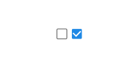   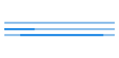      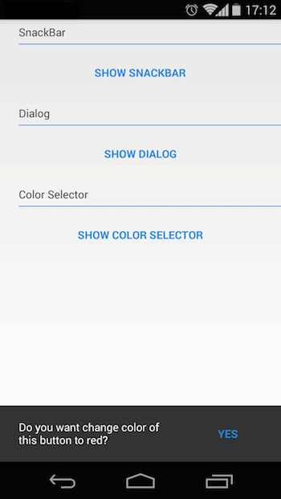  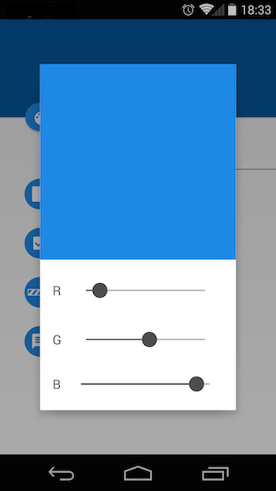
[DrawerArrowDrawable](https://github.com/ChrisRenke/DrawerArrowDrawable) | [Apache License V2](https://www.apache.org/licenses/LICENSE-2.0) | 
[MaterialTabs](https://github.com/neokree/MaterialTabs) | [Apache License V2](https://www.apache.org/licenses/LICENSE-2.0) |  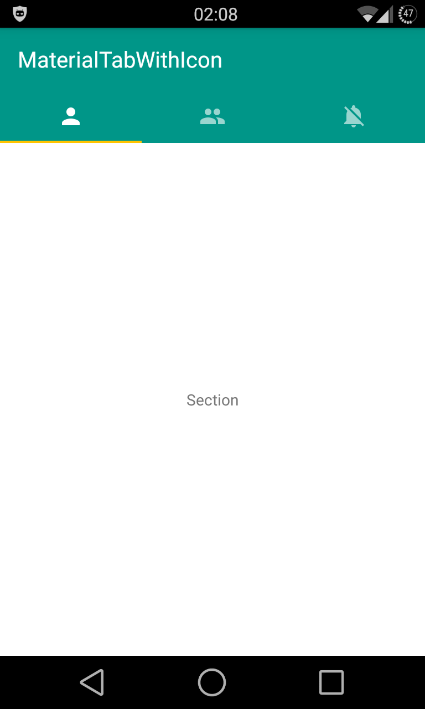 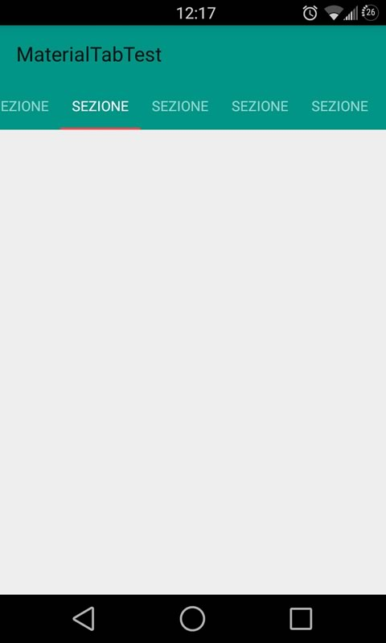
[material-ripple](https://github.com/balysv/material-ripple) | [Apache License V2](https://www.apache.org/licenses/LICENSE-2.0) | 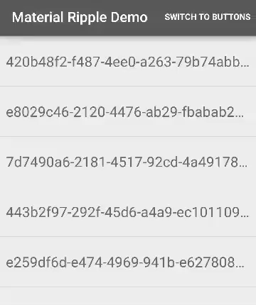
[RippleEffect](https://github.com/traex/RippleEffect) | [MIT](http://opensource.org/licenses/MIT) | 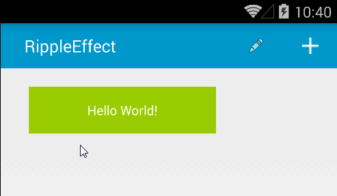
[LDrawer](https://github.com/ikimuhendis/LDrawer) | [Apache License V2](https://www.apache.org/licenses/LICENSE-2.0) | 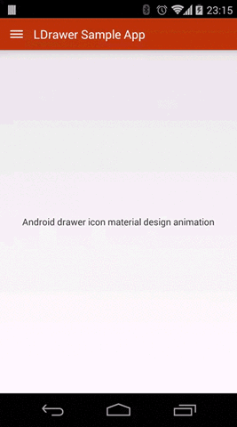
[material-design-icons](https://github.com/google/material-design-icons) | [Apache License V2](https://www.apache.org/licenses/LICENSE-2.0) | 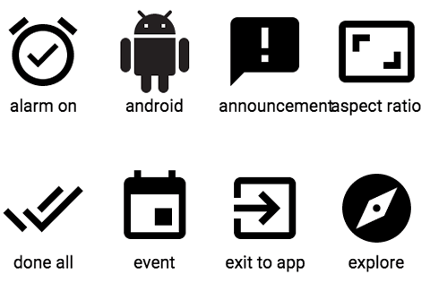
[AndroidMaterialDesignToolbar](https://github.com/tekinarslan/AndroidMaterialDesignToolbar) | UnKnown | 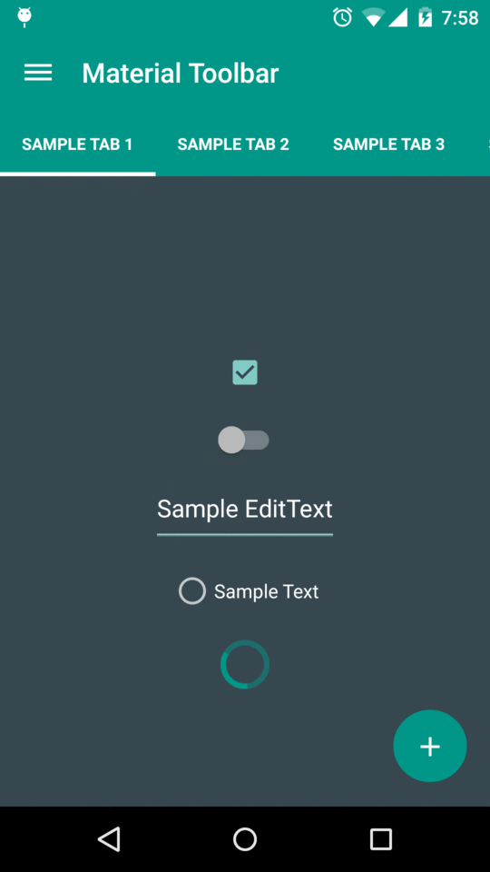
[MaterialEditText](https://github.com/rengwuxian/MaterialEditText) | [Apache License V2](https://www.apache.org/licenses/LICENSE-2.0) | 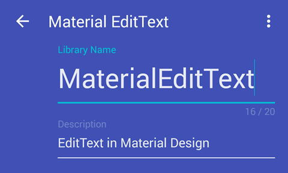
[material-menu](https://github.com/balysv/material-menu) | [Apache License V2](https://www.apache.org/licenses/LICENSE-2.0) | 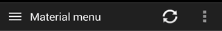 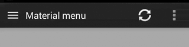
[material-dialogs](https://github.com/afollestad/material-dialogs) | [Apache License V2](https://www.apache.org/licenses/LICENSE-2.0) | 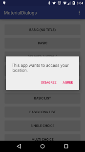 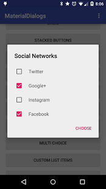 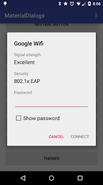
[MaterialNavigationDrawer](https://github.com/neokree/MaterialNavigationDrawer) | [Apache License V2](https://www.apache.org/licenses/LICENSE-2.0) | 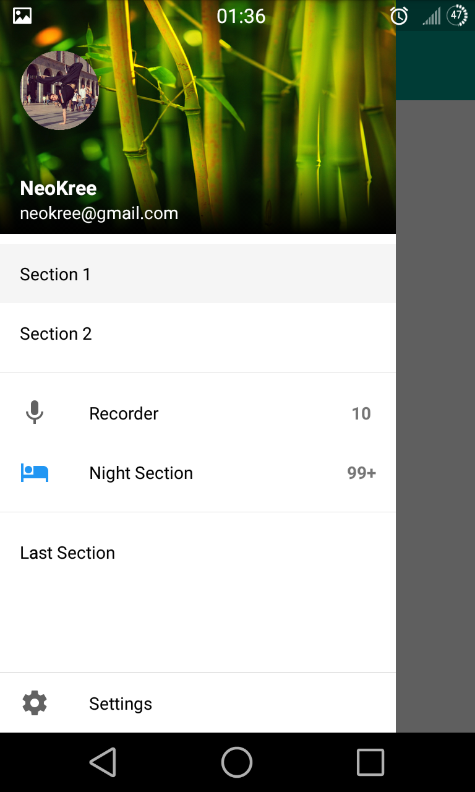
[MaterialDialog](https://github.com/drakeet/MaterialDialog) | [Apache License V2](https://www.apache.org/licenses/LICENSE-2.0) | 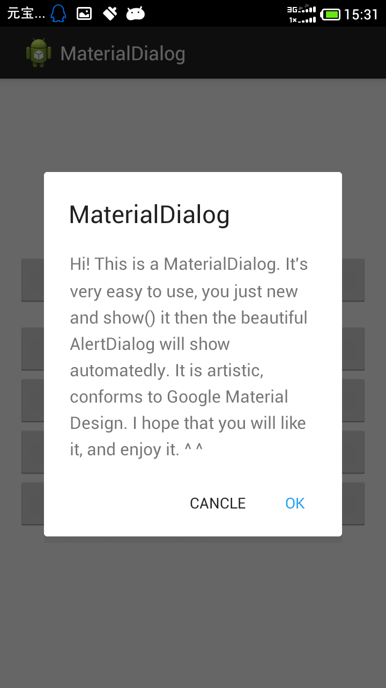 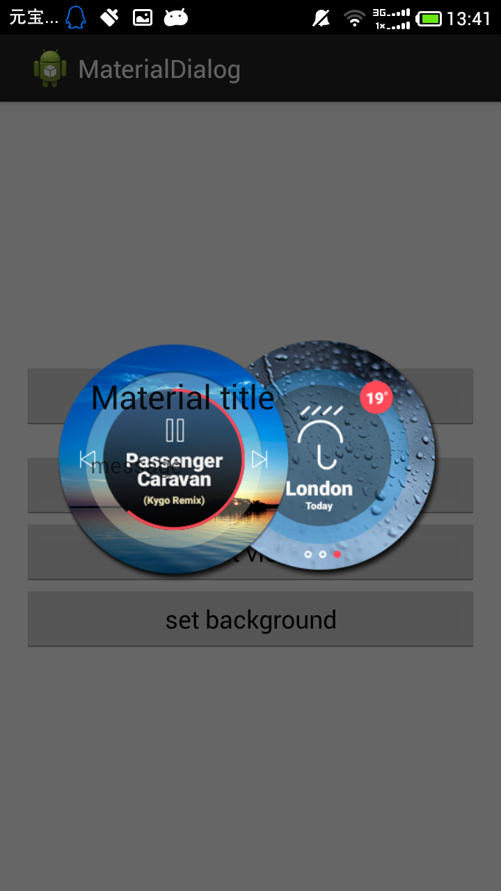
[materialish-progress](https://github.com/pnikosis/materialish-progress) | [Apache License V2](https://www.apache.org/licenses/LICENSE-2.0) | 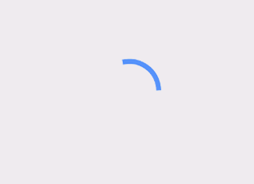 
[FloatingActionButton](https://github.com/makovkastar/FloatingActionButton) | [MIT](http://opensource.org/licenses/MIT) | 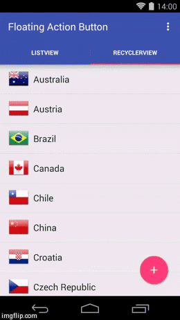
[android-floating-action-button](https://github.com/futuresimple/android-floating-action-button) | [Apache License V2](https://www.apache.org/licenses/LICENSE-2.0) |  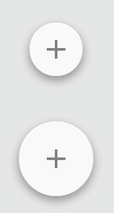
[snackbar](https://github.com/nispok/snackbar) | [Apache License V2](https://www.apache.org/licenses/LICENSE-2.0) | 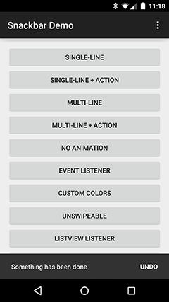
[CircularReveal](https://github.com/ozodrukh/CircularReveal) | [Apache License V2](https://www.apache.org/licenses/LICENSE-2.0) | 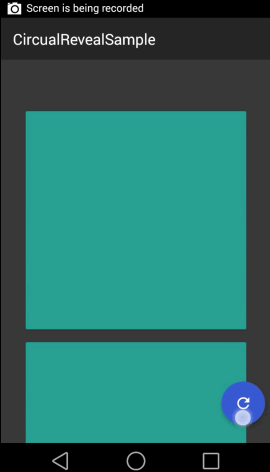

Layout
======================
Name | License | Demo
--- | --- | ---
[WaveView](https://github.com/john990/WaveView) | Unknown | 

Button
======================
Name | License | Demo
--- | --- | ---
[circular-progress-button](https://github.com/dmytrodanylyk/circular-progress-button) | [Apache License V2](https://www.apache.org/licenses/LICENSE-2.0) | 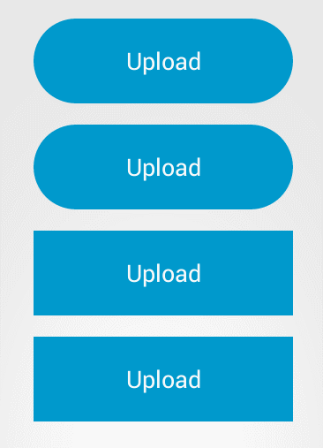
[android-process-button](https://github.com/dmytrodanylyk/android-process-button) | [Apache License V2](https://www.apache.org/licenses/LICENSE-2.0) |  
[android-circlebutton](https://github.com/markushi/android-circlebutton) | [Apache License V2](https://www.apache.org/licenses/LICENSE-2.0) | 
[android-flat-button](https://github.com/hoang8f/android-flat-button) | [Apache License V2](https://www.apache.org/licenses/LICENSE-2.0) | 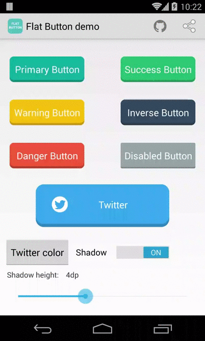

ListView / GridView / RecyclerView
======================
Name | License | Demo
--- | --- | ---
[SuperRecyclerView](https://github.com/Malinskiy/SuperRecyclerView) | [Apache License V2](https://www.apache.org/licenses/LICENSE-2.0) | NONE
[FlabbyListView](https://github.com/jpardogo/FlabbyListView) | [Apache License V2](https://www.apache.org/licenses/LICENSE-2.0) | 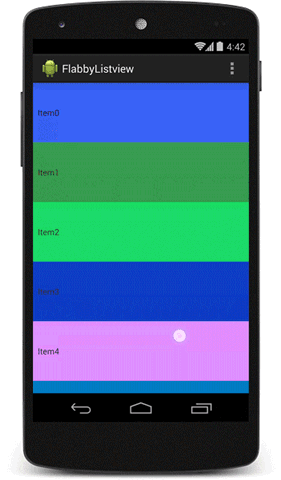 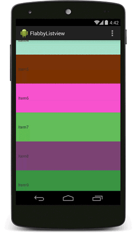
[ParallaxListView](https://github.com/Gnod/ParallaxListView) | UnKnown | 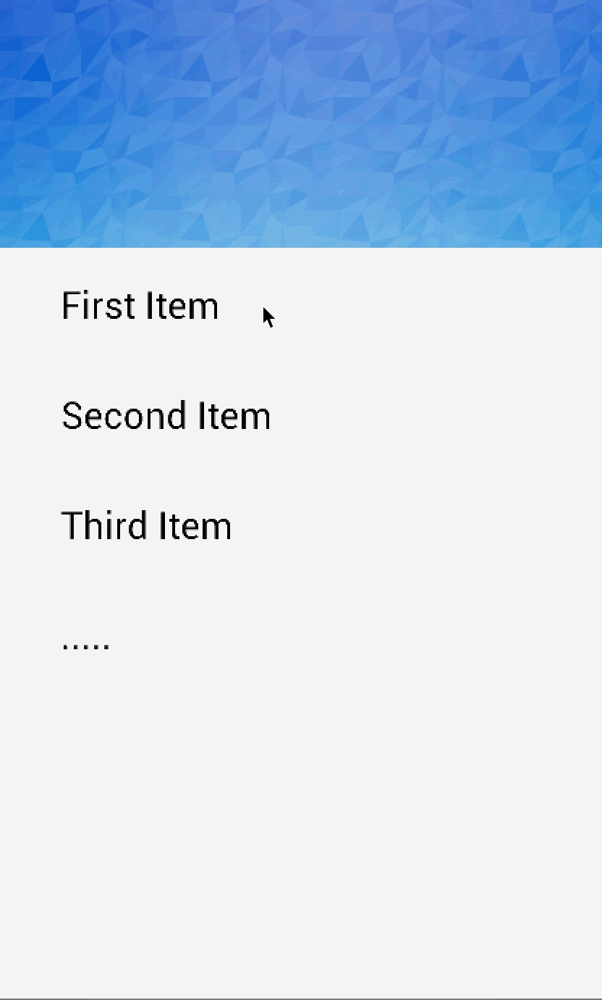
[PullZoomView](https://github.com/Frank-Zhu/PullZoomView) | [Apache License V2](https://www.apache.org/licenses/LICENSE-2.0) | 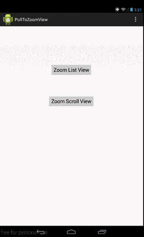
[SwipeMenuListView](https://github.com/baoyongzhang/SwipeMenuListView) | [MIT](http://opensource.org/licenses/MIT) | 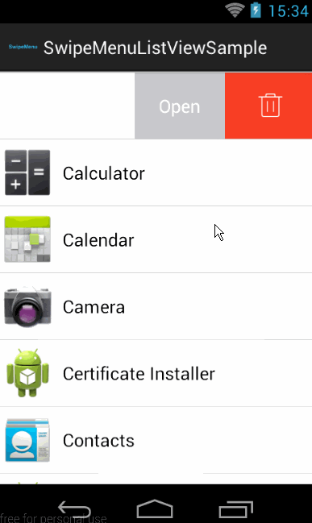
[discrollview](https://github.com/flavienlaurent/discrollview) | [Apache License V2](https://www.apache.org/licenses/LICENSE-2.0) | 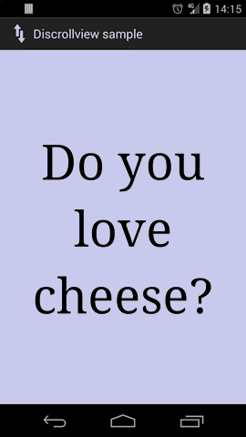
[StickyListHeaders](https://github.com/emilsjolander/StickyListHeaders) | [Apache License V2](https://www.apache.org/licenses/LICENSE-2.0) | 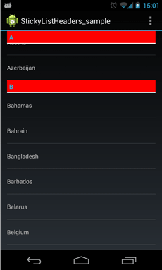
[ListBuddies](https://github.com/jpardogo/ListBuddies) | [Apache License V2](https://www.apache.org/licenses/LICENSE-2.0) | <a href="https://www.youtube.com/watch?v=jgyMqlm_iDI" target="_blank">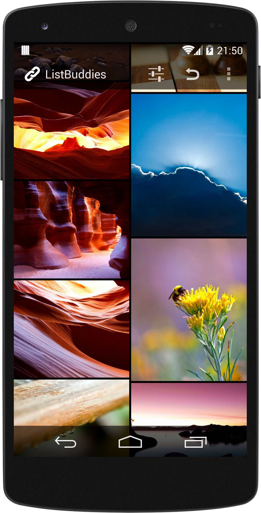</a>
[Android-ObservableScrollView](https://github.com/ksoichiro/Android-ObservableScrollView) | [Apache License V2](https://www.apache.org/licenses/LICENSE-2.0) | 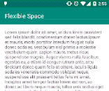 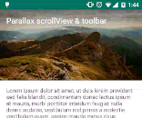 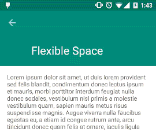 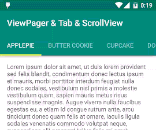 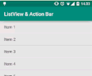  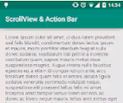 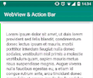 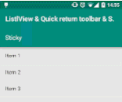 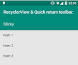 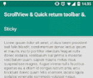 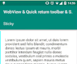 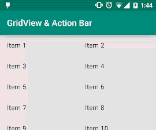
[AsymmetricGridView](https://github.com/felipecsl/AsymmetricGridView) | [Apache License V2](https://www.apache.org/licenses/LICENSE-2.0) | 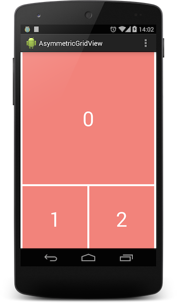 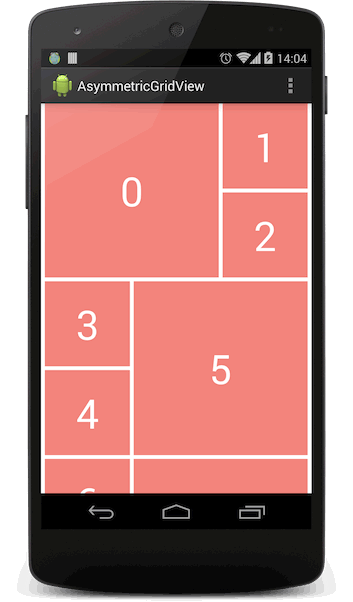
[DynamicGrid](https://github.com/askerov/DynamicGrid) | [MIT](http://opensource.org/licenses/MIT) | <a href="https://www.youtube.com/watch?v=zlzNvxksIfY" target="_blank">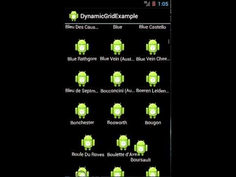</a>
[AndroidStaggeredGrid](https://github.com/etsy/AndroidStaggeredGrid) | [Apache License V2](https://www.apache.org/licenses/LICENSE-2.0) | 

Label / Form
======================
Name | License | Demo
--- | --- | ---
[Shimmer-android](https://github.com/RomainPiel/Shimmer-android) | [Apache License V2](https://www.apache.org/licenses/LICENSE-2.0) | 
[Titanic](https://github.com/RomainPiel/Titanic) | [Apache License V2](https://www.apache.org/licenses/LICENSE-2.0) | 
[MatchView](https://github.com/Rogero0o/MatchView) | [Apache License V2](https://www.apache.org/licenses/LICENSE-2.0) | 
[android-autofittextview](https://github.com/grantland/android-autofittextview) | [Apache License V2](https://www.apache.org/licenses/LICENSE-2.0) | 
[SecretTextView](https://github.com/matthewrkula/SecretTextView) | UnKnown | 
[TextJustify-Android](https://github.com/bluejamesbond/TextJustify-Android) | [Apache License V2](https://www.apache.org/licenses/LICENSE-2.0) |  
[RoundedLetterView](https://github.com/pavlospt/RoundedLetterView) | [Apache License V2](https://www.apache.org/licenses/LICENSE-2.0) | 
[TextDrawable](https://github.com/amulyakhare/TextDrawable) | [Apache License V2](https://www.apache.org/licenses/LICENSE-2.0) |  
[BabushkaText](https://github.com/quiqueqs/BabushkaText) | [Apache License V2](https://www.apache.org/licenses/LICENSE-2.0) | 
[ExpandableTextView](https://github.com/Manabu-GT/ExpandableTextView) | [Apache License V2](https://www.apache.org/licenses/LICENSE-2.0) | 
[Float Labeled EditText](https://github.com/wrapp/floatlabelededittext) | [Apache License V2](https://www.apache.org/licenses/LICENSE-2.0) | 

Image
======================
Name | License | Demo
--- | --- | ---
[TouchImageView](https://github.com/MikeOrtiz/TouchImageView) | [LICENSE](https://raw.githubusercontent.com/MikeOrtiz/TouchImageView/master/LICENSE) | NONE
[CircleImageView](https://github.com/hdodenhof/CircleImageView) | [Apache License V2](https://www.apache.org/licenses/LICENSE-2.0) | 
[android-shape-imageview](https://github.com/siyamed/android-shape-imageview) | [Apache License V2](https://www.apache.org/licenses/LICENSE-2.0) |  
[GifImageView](https://github.com/felipecsl/GifImageView) | [MIT](http://opensource.org/licenses/MIT) | 
[cropper](https://github.com/edmodo/cropper) | [Apache License V2](https://www.apache.org/licenses/LICENSE-2.0) | 
[android-crop](https://github.com/jdamcd/android-crop) | [Apache License V2](https://www.apache.org/licenses/LICENSE-2.0) | 
[SelectableRoundedImageView](https://github.com/pungrue26/SelectableRoundedImageView) | [Apache License V2](https://www.apache.org/licenses/LICENSE-2.0) | 

SeekBar
======================
Name | License | Demo
--- | --- | ---
[DiscreteSeekBar](https://github.com/AnderWeb/discreteSeekBar) | [Apache License V2](https://www.apache.org/licenses/LICENSE-2.0) |  

Progress
======================
Name | License | Demo
--- | --- | ---
[SmoothProgressBar](https://github.com/castorflex/SmoothProgressBar) | [Apache License V2](https://www.apache.org/licenses/LICENSE-2.0) | 
[NumberProgressBar](https://github.com/daimajia/NumberProgressBar) | [MIT](http://opensource.org/licenses/MIT) | 
[CircleProgress](https://github.com/lzyzsd/CircleProgress) | UnKnown | 
[android-square-progressbar](https://github.com/mrwonderman/android-square-progressbar) | UnKnown |   
[GoogleProgressBar](https://github.com/jpardogo/GoogleProgressBar) | [Apache License V2](https://www.apache.org/licenses/LICENSE-2.0) |   

Menu
======================
Name | License | Demo
--- | --- | ---
[CircularFloatingActionMenu](https://github.com/oguzbilgener/CircularFloatingActionMenu) | [MIT](http://opensource.org/licenses/MIT) | 
[AndroidResideMenu](https://github.com/SpecialCyCi/AndroidResideMenu) | [MIT](http://opensource.org/licenses/MIT) | 

Calendar
======================
Name | License | Demo
--- | --- | ---
[Caldroid](https://github.com/roomorama/Caldroid) | [MIT](http://opensource.org/licenses/MIT) | 
[android-times-square](https://github.com/square/android-times-square) | [Apache License V2](https://www.apache.org/licenses/LICENSE-2.0) | 
[Android-MonthCalendarWidget](https://github.com/romannurik/Android-MonthCalendarWidget) | [Apache License V2](https://www.apache.org/licenses/LICENSE-2.0) | 
[android-betterpickers](https://github.com/derekbrameyer/android-betterpickers) | [Apache License V2](https://www.apache.org/licenses/LICENSE-2.0) | 
[Android-Week-View](https://github.com/alamkanak/Android-Week-View) | [Apache License V2](https://www.apache.org/licenses/LICENSE-2.0) | 

Graph
======================
Name | License | Demo
--- | --- | ---
[EazeGraph](https://github.com/blackfizz/EazeGraph) | [Apache License V2](https://www.apache.org/licenses/LICENSE-2.0)  |    
[hellocharts-android](https://github.com/lecho/hellocharts-android) | [Apache License V2](https://www.apache.org/licenses/LICENSE-2.0)  |   
[MPAndroidChart](https://github.com/PhilJay/MPAndroidChart) | [Apache License V2](https://www.apache.org/licenses/LICENSE-2.0)  |    

Animation
======================
Name | License | Demo
--- | --- | --- | ---
[AndroidViewAnimations](https://github.com/daimajia/AndroidViewAnimations) | [MIT](http://opensource.org/licenses/MIT) | 
[ListViewAnimations](https://github.com/nhaarman/ListViewAnimations) | [Apache License V2](https://www.apache.org/licenses/LICENSE-2.0) | 
[ViewPagerTransforms](https://github.com/ToxicBakery/ViewPagerTransforms) | [Apache License V2](https://www.apache.org/licenses/LICENSE-2.0) | 
[AndroidImageSlider](https://github.com/daimajia/AndroidImageSlider) | [MIT](http://opensource.org/licenses/MIT) | 
[transitions-everywhere](https://github.com/andkulikov/transitions-everywhere) | [Apache License V2](https://www.apache.org/licenses/LICENSE-2.0) | 
[CircleIndicator](https://github.com/ongakuer/CircleIndicator) | [MIT](http://opensource.org/licenses/MIT) | 

Parallax
======================
Name | License | Demo
--- | --- | ---
[ParallaxEverywhere](https://github.com/Narfss/ParallaxEverywhere) | [MIT](http://opensource.org/licenses/MIT) | 
