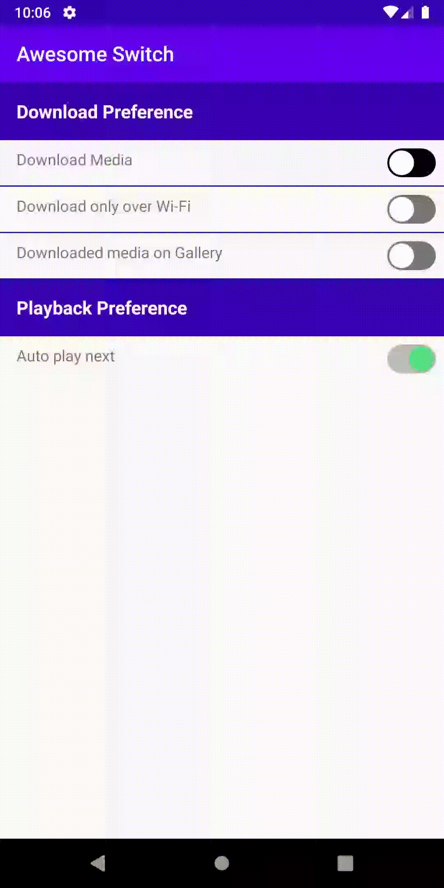

Button
======================
Name | License | Demo
--- | --- | ---
[circular-progress-button](https://github.com/dmytrodanylyk/circular-progress-button) | [Apache License V2](https://www.apache.org/licenses/LICENSE-2.0) | 
[android-process-button](https://github.com/dmytrodanylyk/android-process-button) | [Apache License V2](https://www.apache.org/licenses/LICENSE-2.0) |  
[android-circlebutton](https://github.com/markushi/android-circlebutton) | [Apache License V2](https://www.apache.org/licenses/LICENSE-2.0) | 
[android-flat-button](https://github.com/hoang8f/android-flat-button) | [Apache License V2](https://www.apache.org/licenses/LICENSE-2.0) | 
[MovingButton](https://github.com/TheFinestArtist/MovingButton) | [MIT](https://opensource.org/licenses/MIT) | 
[LabelView](https://github.com/linger1216/labelview) | [Apache License V2](https://www.apache.org/licenses/LICENSE-2.0) | 
[transition-button-android](https://github.com/roynx98/transition-button-android) | [MIT](https://opensource.org/licenses/MIT) | 
[KTLoadingButton](https://github.com/timonknispel/KTLoadingButton) | [MIT](https://opensource.org/licenses/MIT) |   
[AwesomeSwitch](https://github.com/anoop44/AwesomeSwitch) | [Apache License V2](https://www.apache.org/licenses/LICENSE-2.0) | 
